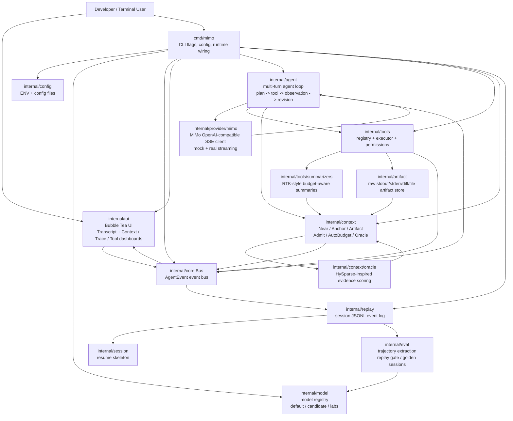

# MiMo Value Amplifier TUI

MiMo Value Amplifier TUI is a MiMo-first terminal coding agent.

It has two goals:

1. Make hidden MiMo capabilities visible, controllable, and replayable.
2. Make MiMo a strong coding agent inside the terminal.

This project is not a generic chat TUI wrapped around a model. It is a coding
cockpit for MiMo: context governance, evidence flow, tool execution, artifacts,
agent trace, replay, and model-update gates all live in one terminal workflow.

## Product Principle

The guiding question is:

> Which MiMo capability is not yet felt by the user, and how can the TUI turn it
> into visible, controllable, replayable productivity?

That means:

- 1M context becomes a governed `Context Map`, not a giant prompt bucket.
- SWA/GA is represented as evidence placement, not fake attention.
- HySparse-inspired thinking becomes a `Context Oracle` that promotes and demotes evidence.
- MTP streaming becomes perceived momentum: chat deltas, tool progress, trace, and cost update together.
- Agentic RL becomes visible `goal -> plan -> action -> observation -> revision` traces.
- Model updates go through `default / candidate / labs` channels and replay gates.
- Raw tool output never enters the model context directly; it is stored as an artifact first.
- Skills, MCP servers, tools, and sub-agents appear in the right-side activity
  dashboards. Background delegation stays visible and replayable without turning
  the main transcript into a noisy operations log.

## Visibility Model

MiMo-TUI is designed so delegation is not a black box. When the agent uses a
tool, loads a skill, discovers an MCP server, or delegates work to a sub-agent,
that activity belongs in the event log and the dashboard.

The main transcript stays quiet: it should contain the user request, MiMo's
answer, concise tool / observation markers, and the final synthesis. The
right-side dashboard is where users inspect operational detail:

- tools: approval state, command summary, result status, artifact links
- skills: discovered, loaded, applied, skipped, or blocked
- MCP: configured servers, discovered tools, pending calls, safety state
- sub-agents: delegated goal, current step, worktree boundary, merge status

This is the intended difference from Claude Code-style background delegation:
MiMo-TUI can delegate in the background, but the delegation trail remains
visible, replayable, and reviewable without polluting the primary conversation.

## Current Status

Approximate completion:

- Usable MVP: about 99%
- Stable daily AI coding product: about 90%
- Full MiMo value-amplifier vision: about 70%

Already implemented:

- Go single-binary CLI: `cmd/mimo`.
- Bubble Tea / Lip Gloss TUI with a transcript-first coding flow plus Context Map, Agent Trace, and Tool Cockpit dashboards.
- Multi-turn agent loop wired from TUI prompt input via `EventUserPrompt`.
- OpenAI-compatible MiMo SSE streaming client with mock fallback.
- Structured HTTP errors, retry/backoff, and streaming parser tests.
- Model registry with `default`, `candidate`, and `labs` channels.
- Replay gate with golden sessions and trajectory comparison.
- Context engine with `Near / Anchor / Artifact`, `Admit`, `AutoBudget`, `SelectionReason`, and `ReplacedBy`.
- HySparse-inspired Context Oracle with scoring and promote/demote review.
- Tool registry, permissions, approval flow, and artifact-backed raw output.
- RTK-style budget-aware summarizers for built-in tools.
- JSONL session replay, resume skeleton, and trajectory eval.
- Prompt queue with FIFO ordering and Ctrl+G interrupt.
- Session resume with history reconstruction and context restoration.
- Context compression with ReplacedBy lineage tracking.
- Policy.toml integration with allowlist/denylist/require_confirm.
- Rollback snapshots before mutating tools with CLI restore.
- Benchmark harness with 5 coding task definitions.
- Long-run endurance testing.
- 1M context pressure testing.
- Trust UI with goal/plan/risk/verification display.
- Secret redaction in shell output (API keys, tokens, bearer tokens).
- Shell risk detection with safety grades (read-only, mutation, destructive).
- Configurable approval timeout via `policy.toml`.
- Input redaction for large content/patch payloads in artifact storage.
- Multi-language test detection for `run_test` (Go, npm, pnpm, yarn, Python, Rust).
- Model registry with channel gating and labs unlock via `MIMO_LABS`.
- Golden session marking and replay gate evaluation with `-golden-session` and `-candidate-session`.
- Rollback CLI commands: `-rollback-list`, `-rollback-show`, `-rollback-apply`, `-rollback-confirm`.

## Architecture



## Core Data Flow

```text
user prompt
  -> EventUserPrompt
  -> agent.Loop
  -> MiMo streaming
  -> tool calls
  -> tool executor
  -> raw output -> artifact
  -> budget-aware summarizer -> observation
  -> Context.Admit
  -> inline transcript + Context Map / Agent Trace / Tool Cockpit
  -> replay JSONL
```

The important rule:

```text
raw output -> artifact -> bounded observation -> context admission
```

Raw stdout, stderr, diffs, file content, screenshots, and future audio/device
state must stay artifact-backed unless intentionally summarized.

## How This Differs From DeepSeek-TUI

DeepSeek-TUI is a mature DeepSeek V4 terminal coding agent. MiMo-TUI is a
MiMo-architecture-driven coding cockpit.

| Area | DeepSeek-TUI | MiMo-TUI |
| --- | --- | --- |
| Product center | DeepSeek coding agent | MiMo capability amplifier + coding agent |
| Model logic | DeepSeek V4, thinking mode, auto model/thinking routing | MiMo model registry, candidate/labs channels, replay gate |
| Context | 1M tracking, compaction, prefix-cache telemetry | Near / Anchor / Artifact, admission, oracle, selection reasons |
| Reasoning display | DeepSeek reasoning blocks | Agent Trace without fake hidden thinking |
| Tool output | Tool results in coding workflow | Artifact-first output, RTK-style summarized observations |
| Safety | Plan / Agent / YOLO, approval, rollback | Approval, context admission, replay, rollback snapshots with CLI restore |
| Direction | Mature terminal agent | MiMo-specific evidence cockpit and future multimodal/device adapters |

We borrow architecture lessons, not code. The project stays clean-room.

## Local Run

```sh
go run ./cmd/mimo
```

Headless smoke mode:

```sh
MIMO_MOCK=1 go run ./cmd/mimo -smoke -session smoke-local
```

With MiMo Token Plan credentials:

```sh
export MIMO_BASE_URL="https://token-plan-cn.xiaomimimo.com/v1"
export MIMO_API_KEY="..."
export MIMO_MODEL="mimo-v2.5-pro"
go run ./cmd/mimo
```

Never commit API keys. Keep credentials in environment variables or local,
ignored config files.

## Useful CLI Flags

- `-workspace <dir>`: run against a workspace other than the configured default.
- `-session <id>`: choose the `.mimo/sessions/<id>.jsonl` event log name.
- `-resume-latest`: inject a compact latest-session summary into startup context.
- `-smoke`: run the event pipeline without launching the full-screen TUI.
- `-smoke-timeout <duration>`: override headless validation timeout.
- `-eval`: extract and print trajectory info for a session.
- `-eval-session <id>`: evaluate a specific session.
- `-list-models`: print registered models.
- `-golden-session <id>`: mark a session as golden.
- `-candidate-session <id>`: candidate session used for replay gate comparison.
- `-model-accept <model>`: accept a candidate model if replay gate passes.

Labs models are gated. Set this only when intentionally testing labs:

```sh
export MIMO_LABS=1
```

## TUI Controls

- Type normally: start prompt input in the persistent bottom bar.
- `/`: enter prompt input mode explicitly.
- `Enter`: submit prompt.
- `Esc`: cancel prompt/help/approval.
- `Tab` / `Shift+Tab`: switch transcript and dashboard views.
- Right-side dashboard views show Context Map, Agent Trace, Tool Cockpit, and
  activity timelines for tools, skills, MCP, and sub-agents as they are wired.
- `Ctrl+L`: clear chat display.
- `Ctrl+R`: request context oracle review.
- `?`: toggle help.
- `Ctrl+C`: quit.

## Validation

Run before committing:

```sh
gofmt -w <changed go files>
go test ./...
go vet ./...
MIMO_MOCK=1 go run ./cmd/mimo -smoke -session smoke-local
```

Real MiMo smoke, only with environment-provided credentials:

```sh
MIMO_BASE_URL="https://token-plan-cn.xiaomimimo.com/v1" \
MIMO_MODEL="mimo-v2.5-pro" \
go run ./cmd/mimo -smoke -smoke-timeout 60s -session smoke-real
```

## Next Priorities

The next development steps should focus on moving from local 1.0 readiness to
multi-language, multi-agent production use:

1. Implement real MCP stdio transport and remote server discovery.
2. Wire sub-agent task execution with isolated worktrees and trace merge.
3. Upgrade the Go diagnostics tool into a real LSP-backed diagnostics layer.
4. Add Node.js, Python, and Rust diagnostics and benchmark suites.
5. Add semantic context oracle scoring with embeddings or MiMo review scoring.
6. Add per-tool and per-safety-grade approval timeout configuration.
7. Display provider token usage and cost estimates during streaming when available.

## Documentation

- [Quickstart guide](docs/QUICKSTART.md)
- [Configuration reference](docs/CONFIGURATION.md)
- [Release readiness audit](docs/RELEASE_READINESS.md)
- [Known limitations](docs/KNOWN_LIMITATIONS.md)
- [Full development guide](docs/FULL_DEVELOPMENT_GUIDE.md)
- [Architecture notes](docs/ARCHITECTURE.md)
- [MiMo value amplifier spec](docs/MIMO_VALUE_AMPLIFIER.md)
- [Agent contracts](docs/AGENT_CONTRACTS.md)
- [Critical thinking agent contract](docs/CRITICAL_THINKING_AGENT.md)
- [Eval plan](docs/EVALS.md)
- [Clean-room policy](docs/CLEAN_ROOM.md)
