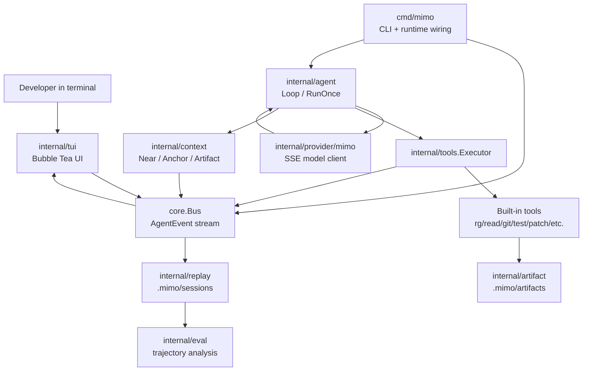

# MiMo Value Amplifier TUI 全量开发文档

## 1. 项目定位

MiMo Value Amplifier TUI 是一个 Go 语言实现的终端 AI coding agent。它的核心不是“把聊天搬进终端”，而是把 MiMo 的模型能力变成开发者可看见、可干预、可复盘的工作台。

产品判断：

- 1M context 不是“更大的 prompt 桶”，而是一个需要被治理的用户界面问题。
- agentic coding 不是黑箱自动化，而是可观察的 `goal -> plan -> action -> observation -> revision` 轨迹。
- tool loop 的价值不在于执行命令本身，而在于把 raw output 变成 artifact，再把 artifact 变成可控 observation。
- TUI 的价值是低延迟、不中断开发流、适合长任务观察和局部审批。

非目标：

- 不伪造 MiMo 的内部 attention。
- 不把 1M context 当垃圾桶。
- 不把 raw stdout/stderr/diff 直接塞进模型上下文。
- 不自动把新模型切成默认模型；新模型先进 Labs/candidate channel。
- 不复制 Claude Code、DeepSeek-TUI、RTK 等参考项目代码，只吸收架构思想后 clean-room 实现。

## 2. 当前能力快照

当前主线已经具备：

- Go 单 binary CLI：`cmd/mimo`。
- Bubble Tea/Lip Gloss TUI：Context Map、Chat Stream、Agent Trace、Tool Cockpit。
- OpenAI-compatible MiMo streaming provider。
- 默认 MiMo model id：`mimo-v2.5-pro`。
- mock provider：无 key 或 `MIMO_MOCK=1` 时稳定开发。
- 多步 agent loop：模型输出 tool calls 后执行工具，再把结果反馈给模型。
- Tool Executor：权限策略、审批事件、tool start/result/observation 事件。
- Artifact Store：raw output 落盘到 `.mimo/artifacts`。
- Context Manager：Near/Anchor/Artifact、pin/unpin/remove、AutoBudget、pollution risk。
- Replay/Session：`.mimo/sessions/*.jsonl` event log、latest session、resume summary。
- Eval：trajectory extraction、trajectory comparison。
- TUI 输入：prompt input、approval input、help、scroll、context pin/remove 事件。

## 3. 总体架构



设计重点：

- `core.AgentEvent` 是 UI、agent、tools、replay 的共同语言。
- TUI 不直接调用 provider 或 tool；它只显示事件、发出用户输入/审批/context 操作事件。
- Agent 不读 raw artifacts；它通过 `Observation` 和 `ContextSnapshot` 理解工具结果。
- Replay 不是调试残留，而是模型升级和行为回归的基础数据。

## 4. 包结构

### `cmd/mimo`

职责：

- 解析 CLI flags。
- 加载配置。
- 初始化 event bus、context manager、tool registry、tool executor、provider。
- 启动 replay writer。
- 连接 TUI 与 agent runtime。

关键 flags：

- `-smoke`：headless smoke，不启动全屏 TUI。
- `-smoke-timeout`：headless smoke 最大等待时间。
- `-workspace`：指定工作目录。
- `-session`：指定 `.mimo/sessions/<id>.jsonl`。
- `-resume-latest`：把最新可用 session 的 summary 注入启动 Context Map。

### `internal/core`

职责：

- 定义跨包 contracts。
- 定义 `AgentEvent`、`ModelEvent`、`ToolCall`、`ToolSpec`、`ContextItem`、`Observation`。
- 定义 tool permission 和 approval 数据结构。
- 提供 `core.Bus` 作为事件广播。

关键事件：

- `message_delta`
- `tool_start`
- `tool_result`
- `observation`
- `context_update`
- `context_pin`
- `context_unpin`
- `context_remove`
- `approval_needed`
- `trace_update`
- `cost_update`
- `error`
- `done`

### `internal/provider/mimo`

职责：

- 调用 MiMo/OpenAI-compatible `/chat/completions`。
- 处理 SSE streaming。
- 解析 text delta、usage、tool call delta。
- 支持 mock stream。

配置：

```sh
export MIMO_BASE_URL="https://token-plan-cn.xiaomimimo.com/v1"
export MIMO_MODEL="mimo-v2.5-pro"
export MIMO_API_KEY="..."
```

注意：

- API key 不得写入仓库。
- `mimo-v2.5-pro[1m]` 是错误的 API model id；1M 是能力属性，不是当前默认 model id。

### `internal/agent`

职责：

- 构造 MiMo system prompt。
- 注入 Context Map summary。
- 调用 provider streaming。
- 收集 model tool calls。
- 调用 `ToolExecutor` 执行工具。
- 把 tool result 反馈为 `tool` role message。
- 把 observation 晋升为 context item。
- 发布 Agent Trace。
- 控制 max steps、step timeout、total timeout。

核心循环：

```text
context snapshot
  -> model stream
  -> text deltas / tool calls
  -> if no tool calls: final answer and done
  -> execute tools
  -> artifact + observation
  -> context promotion + auto budget
  -> next model step
```

Agent Trace 规则：

- 每个模型 step 有 running/done/failed trace。
- 每个 tool execution 有独立 trace。
- 失败进入 `Revision`，而不是被吞掉。
- 不暴露隐藏 chain-of-thought，只展示可审计状态。

### `internal/tools`

职责：

- 管理 tool registry。
- 提供 built-in tools。
- 执行 permission/approval policy。
- 发布 tool events。
- 把 raw output 写入 artifact。
- 把结果压缩为 `Observation`。

当前工具：

- `list_dir`
- `rg`
- `read_file`
- `git_status`
- `git_diff`
- `git_log`
- `artifact_read`
- `write_file`
- `apply_patch`
- `shell`
- `run_test`

权限策略：

- Read-only 工具默认 `allow`。
- Mutating 工具默认 `ask`。
- `Executor` 可通过 approval channel 请求 TUI 审批。
- 如果无审批或超时，工具必须拒绝执行。

### `internal/artifact`

职责：

- 把 raw outputs 保存到 `.mimo/artifacts/<id>`。
- 写入 `metadata.json`。
- 支持按 artifact id 读取 metadata/payloads。

原则：

- raw stdout/stderr/diff/file content 不直接进入 context。
- 小 payload 可由 `artifact_read` 生成 bounded preview。
- 大 payload 保持 artifact-backed。

### `internal/context`

职责：

- 管理 1M context budget。
- 管理三层 context：
  - `Near`：当前活跃证据和短期工作记忆。
  - `Anchor`：项目地图、任务目标、架构决策、resume skeleton。
  - `Artifact`：大输出和可按需读取的证据。
- 支持 pin/unpin/remove。
- 支持 observation promotion。
- 支持 AutoBudget。

污染风险：

- `low`
- `warning`
- `over_window`

AutoBudget 策略：

- 只自动清理非 pinned 的 Near items。
- expired item 优先清理。
- Anchor 和 pinned item 不自动驱逐。
- 驱逐后发布新的 Context Map。

### `internal/tui`

职责：

- 渲染四面板：
  - Context Map
  - Chat Stream
  - Agent Trace
  - Tool Cockpit
- 接收 `AgentEvent`。
- 支持 panel scroll。
- 支持 help overlay。
- 支持 prompt input。
- 支持 tool approval input。
- 支持 context pin/remove 事件。

TUI 不应该：

- 直接执行 tool。
- 直接调用 provider。
- 伪造 attention。
- 把展示逻辑变成 agent 决策逻辑。

### `internal/replay`

职责：

- 写 `.mimo/sessions/<session>.jsonl`。
- 读 JSONL event log。
- 列出 session。
- 找 latest usable session。
- replay event sequence。

Replay 目标：

- 恢复工作现场。
- 对模型更新做回归。
- 对 tool loop 失败路径做复盘。

### `internal/session`

职责：

- 从 event log 构建 `ResumeSummary`。
- 统计 event counts。
- 抽取 latest context snapshot。
- 抽取 recent trace statuses。
- 抽取 artifact ids。
- 记录 last status/error。

### `internal/eval`

职责：

- 从 event log 抽取 trajectory。
- 比较两个 trajectory。
- 输出 success、step count、tool count、token cost、error diff。

用途：

- MiMo 模型更新前后行为对比。
- 工具策略调整回归。
- 失败案例库。

## 5. MiMo-specific 设计

### 5.1 1M context 的 UI 化

1M context 的最大风险是“用户不知道里面有什么”。所以 Context Map 必须展示：

- 总 token budget。
- 当前 used tokens。
- Near/Anchor/Artifact item。
- pin 状态。
- pollution risk。
- artifact source。
- item reason。

后续强化方向：

- tier token bar。
- per-item age/expiry。
- drag/promote/demote。
- 手动 compress。
- context diff。

### 5.2 SWA/GA 和 attention 的批判性表达

产品里不能说“模型正在注意某文件”，除非模型或 provider 明确返回可验证 attention 数据。当前只能展示：

- 本轮真实注入 prompt 的 context summary。
- 本轮真实执行的 tool calls。
- 本轮真实引用的 artifacts。
- 本轮 Context Map 的 evidence placement。

推荐 UI 文案：

- “Evidence in context”
- “Injected context”
- “Tool-derived observation”
- “Artifact-backed evidence”

避免文案：

- “真实注意力”
- “模型正在看”
- “SWA focus heatmap”

### 5.3 Agentic RL 的可视化

Agent Trace 应该让用户看到：

- 当前 goal。
- 当前 plan。
- 当前 action。
- 当前 observation。
- 当前 risk。
- revise/continue 的理由。

这不是暴露隐藏推理，而是暴露工程状态。

### 5.4 万物互联意图

MiMo 的长期价值不只在 coding，而在跨设备、跨应用、跨模态的信息汇流。当前 TUI 应预留：

- screenshot/image artifact。
- voice progress notification。
- device/app state adapter。
- multimodal observation。
- Labs provider channel。

但 MVP 不应被 TTS/ASR 阻塞。

## 6. 数据流详解

### 6.1 启动

```text
cmd/mimo
  -> config.Load
  -> core.NewBus
  -> replay.NewWriter
  -> context.NewSeeded
  -> tools.NewDefaultRegistry
  -> tools.NewExecutor
  -> provider/mimo.New
  -> tui.Run(events)
  -> agent.Loop(...)
```

### 6.2 Tool Loop

```text
model emits tool_call
  -> Agent publishes tool_start
  -> Executor checks permission
  -> if ask: EventApprovalNeeded
  -> TUI y/n decision
  -> tool.Run
  -> raw output -> artifact store
  -> tool.Summarize -> Observation
  -> Agent promotes Observation -> ContextItem
  -> ContextManager.AutoBudget
  -> next model request includes Context Map summary
```

### 6.3 Replay/Eval

```text
AgentEvent stream
  -> .mimo/sessions/<id>.jsonl
  -> replay.Read/List/Latest
  -> session.BuildResumeSummary
  -> eval.ExtractTrajectory
  -> eval.CompareTrajectories
```

## 7. 配置与运行

Mock 本地 smoke：

```sh
MIMO_MOCK=1 go run ./cmd/mimo -smoke -session smoke-local
```

Resume smoke：

```sh
MIMO_MOCK=1 go run ./cmd/mimo -smoke -resume-latest -session smoke-resume
```

真实 MiMo：

```sh
export MIMO_BASE_URL="https://token-plan-cn.xiaomimimo.com/v1"
export MIMO_MODEL="mimo-v2.5-pro"
export MIMO_API_KEY="..."
go run ./cmd/mimo -smoke -smoke-timeout 60s -session smoke-real
```

全屏 TUI：

```sh
go run ./cmd/mimo
```

## 8. 验证标准

每次提交前必须运行：

```sh
gofmt -w <changed go files>
go test ./...
go vet ./...
MIMO_MOCK=1 go run ./cmd/mimo -smoke -session smoke-local
MIMO_MOCK=1 go run ./cmd/mimo -smoke -resume-latest -session smoke-resume
```

可选真实验证：

```sh
MIMO_BASE_URL="https://token-plan-cn.xiaomimimo.com/v1" \
MIMO_MODEL="mimo-v2.5-pro" \
go run ./cmd/mimo -smoke -smoke-timeout 60s -session smoke-real
```

## 9. GitHub 与分支策略

默认主线：

- `master`

开发流程：

```text
main agent:
  plan
  freeze contracts
  create worktrees
  spawn subagents
  integrate
  test
  merge
  push
  remove worktrees
```

worker branch 命名：

- `codex/<feature-name>`

worker 规则：

- 每个 worker 有明确 ownership。
- 不跨目录改公共 contract，除非主线先冻结。
- 必须提交自己的分支。
- final 输出 changed paths、commit hash、validation、risks。
- 主线验收后合并并删除 worktree/branch。

## 10. 后续开发路线

### Phase A：工具闭环硬化

- TUI prompt input 真正进入 agent loop。
- Approval channel 与 mutating tools 完整联动。
- shell/write/apply_patch/run_test 的安全策略细分。
- tool call schema 更严格。
- tool retry 和 recover。

### Phase B：Context Map 深化

- pin/unpin/remove 从 TUI 事件接入 context manager。
- manual promote/demote。
- token budget 可视化。
- context compression。
- context diff。
- pollution warnings 更清晰。

### Phase C：Replay/Eval 产品化

- `mimo eval` CLI。
- trajectory browser。
- model candidate channel。
- baseline replay。
- tool loop failure corpus。

### Phase D：多模态与语音 Labs

- image artifact preview。
- screenshot ingestion。
- TTS progress summary。
- ASR command input。
- device/app adapter spec。

### Phase E：工程生产化

- 配置文件写入器。
- structured logging。
- CI artifact upload。
- release build。
- plugin/tool sandbox。

## 11. 设计守则

- 所有 raw output 先 artifact，再 observation。
- 所有模型行为必须可 replay。
- 所有 context item 必须有 source 和 reason。
- 所有 mutating tool 必须可被拒绝。
- 所有 UI 状态都来自事件或用户输入，不直接偷读 agent 内部状态。
- 所有 MiMo-specific claim 必须能被当前系统证据支撑。

## 12. 当前风险

- TUI prompt input 已有 UI 层状态，但需要继续接入真正的 runtime prompt submission。
- Approval 事件通路已存在，但需要在全屏运行中做更完整的人工 smoke。
- Context AutoBudget 仍是简单启发式，不是语义压缩。
- Eval 目前是 trajectory 结构化摘要，还不是完整 benchmark runner。
- Provider tool-call parser 需继续用真实 MiMo streaming 样例回归。

## 13. 一句话总结

这个项目的正确方向不是“做一个更漂亮的 TUI”，而是把 MiMo 的长上下文、工具调用、轨迹推理、artifact 记忆和模型更新评估变成一个可被开发者控制的 coding cockpit。

