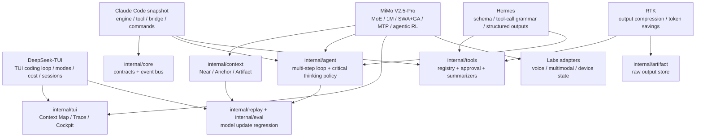
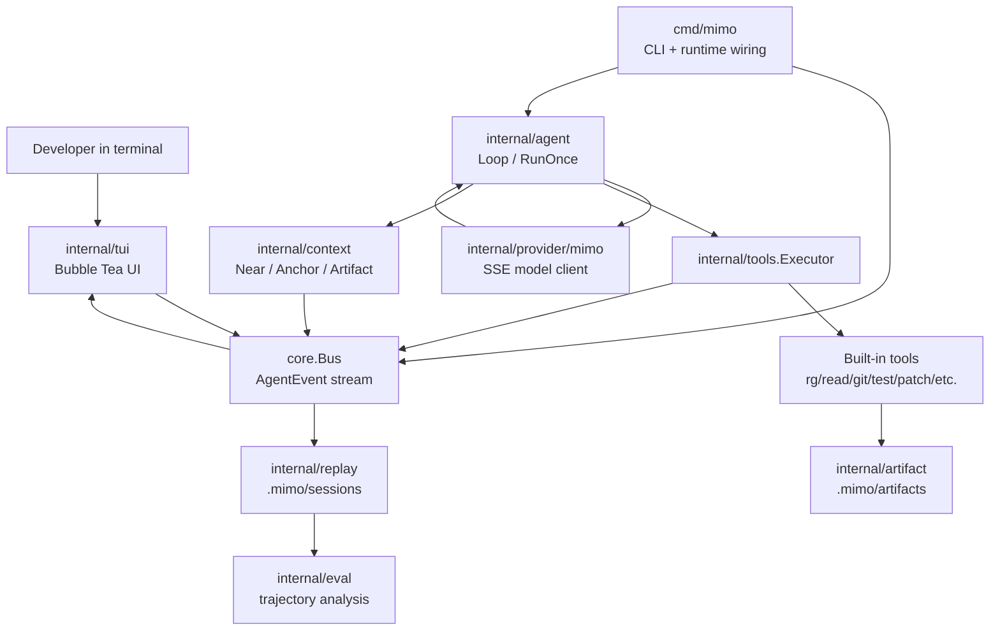

# MiMo Value Amplifier TUI 全量开发文档

## 1. 项目定位

MiMo Value Amplifier TUI 是一个 Go 语言实现的终端 AI coding agent。它的核心不是“把聊天搬进终端”，而是把 MiMo 的模型能力变成开发者可看见、可干预、可复盘的工作台。

产品判断：

- 1M context 不是“更大的 prompt 桶”，而是一个需要被治理的用户界面问题。
- agentic coding 不是黑箱自动化，而是可观察的 `goal -> plan -> action -> observation -> revision` 轨迹。
- tool loop 的价值不在于执行命令本身，而在于把 raw output 变成 artifact，再把 artifact 变成可控 observation。
- TUI 的价值是低延迟、不中断开发流、适合长任务观察和局部审批。

非目标：

- 不伪造 MiMo 的内部 attention。
- 不把 1M context 当垃圾桶。
- 不把 raw stdout/stderr/diff 直接塞进模型上下文。
- 不自动把新模型切成默认模型；新模型先进 Labs/candidate channel。
- 不复制 Claude Code、DeepSeek-TUI、RTK 等参考项目代码，只吸收架构思想后 clean-room 实现。

## 2. 当前能力快照

当前主线已经具备：

- Go 单 binary CLI：`cmd/mimo`。
- Bubble Tea/Lip Gloss TUI：transcript-first 主体验，Context Map、Agent Trace、Tool Cockpit 作为可切换仪表盘。
- OpenAI-compatible MiMo streaming provider。
- 默认 MiMo model id：`mimo-v2.5-pro`。
- mock provider：无 key 或 `MIMO_MOCK=1` 时稳定开发。
- 多步 agent loop：模型输出 tool calls 后执行工具，再把结果反馈给模型。
- Tool Executor：权限策略、审批事件、tool start/result/observation 事件。
- Artifact Store：raw output 落盘到 `.mimo/artifacts`。
- Context Manager：Near/Anchor/Artifact、pin/unpin/remove、AutoBudget、pollution risk。
- Replay/Session：`.mimo/sessions/*.jsonl` event log、latest session、resume summary。
- Eval：trajectory extraction、trajectory comparison。
- TUI 输入：prompt input、approval input、help、scroll、context pin/remove 事件。

## 3. 参考项目、模型架构与设计取舍

本项目的参考方式是 clean-room architecture extraction：只吸收公开文档、模型卡、论文和本地 snapshot 目录结构暴露出的工程分层，不复制实现代码，不把外部项目的产品假设原封不动搬进来。

### 3.1 参考源

| 参考源 | 已确认信息 | 对本项目有价值的部分 | 必须批判的部分 |
| --- | --- | --- | --- |
| [DeepSeek-TUI](https://github.com/Hmbown/DeepSeek-TUI) | 公开 README 定位为 terminal coding agent，强调 TUI、tool suite、approval gates、1M context tracking、session resume、cost reporting、skills、MCP、LSP diagnostics。 | 证明“模型能力仪表盘 + 终端 coding loop”是成立的产品形态；可借鉴 mode、cost、session、tool cockpit、diagnostics 的交互组合。 | 不能把它变成 MiMo 产品的蓝图。DeepSeek 的 thinking blocks、cache reporting、model auto 策略服务的是 DeepSeek；MiMo-first 必须从 MiMo 的 MoE、1M、SWA/GA、MTP、agentic RL 出发重排优先级。 |
| `/Users/karl/apps/claude-code-main.zip` | 只观察目录结构：`QueryEngine.ts`、`Task.ts`、`Tool.ts`、`assistant/sessionHistory.ts`、`bridge/*`、`cli/transports/*`、`commands/*` 等。 | 成熟 coding agent 需要拆出 query engine、task、tool contract、session history、bridge/transport、structured IO、command registry、permission callbacks。 | 不复制代码，不复刻 TypeScript 结构。Go 版只保留工程边界：`core` contract、`agent` loop、`tools` registry、`replay` log、后续 `bridge` adapters。 |
| [RTK](https://github.com/rtk-ai/rtk) | README 定位为 token-saving CLI proxy，核心是先过滤/压缩命令输出，再让 LLM 看到；策略包括 filtering、grouping、truncation、deduplication。 | 直接启发 `artifact -> observation`：raw output 永远落 artifact，模型只吃压缩 observation；后续加入 token saving meter 和 per-tool summarizer。 | 不采用透明 shell rewrite 作为主路径，因为这会让用户和 agent 看不清 raw/summary 的边界。MiMo 的 1M context 很大，但更需要可治理的 evidence ledger。 |
| [XiaomiMiMo/MiMo-V2.5-Pro](https://huggingface.co/XiaomiMiMo/MiMo-V2.5-Pro) | 模型卡标注 MoE、1.02T total / 42B active、1M context、SWA/GA hybrid attention、3-layer MTP、agentic RL/MOPD，并面向复杂软件工程和长轨迹任务。 | 这是产品核心。TUI 必须把长上下文、长工具轨迹、流式速度、上下文证据和风险状态做成用户可控界面。 | 不能把“1M”当无限 prompt；不能伪造 attention；不能因为模型强就省略 verification、replay、approval。 |
| [MiMo-V2-Flash Technical Report](https://arxiv.org/abs/2601.02780) | 论文描述 sparse MoE、SWA/GA hybrid attention、MTP、MOPD、推理加速和 agentic 能力路线。 | 给出 MiMo 系列的训练与系统设计脉络：长任务不是单 prompt，而是多步轨迹、工具结果、奖励/蒸馏和验证闭环。 | Flash 与 V2.5-Pro 的配置不同，不能把论文里的数值机械套用到 V2.5-Pro API。只抽取设计原则。 |
| [HySparse](https://arxiv.org/abs/2602.03560) | 论文提出 full attention layer 作为 oracle 选择稀疏层 token，并复用 KV cache，目标是减少计算和内存同时保留质量。 | 启发 Context Engine：周期性全局审视，选择少量高价值 evidence 进入 Near/Anchor；artifact id 复用类似稳定 cache key。 | 产品 UI 不能显示“真实 HySparse attention”。我们只能显示实际注入的 evidence 和 context placement。 |
| [XiaomiMiMo Hugging Face 组织](https://huggingface.co/XiaomiMiMo) 与 [MiMo API 平台](https://platform.xiaomimimo.com/docs/zh-CN/welcome) | 模型族持续更新，包含 V2.5、V2.5-Pro、ASR、Audio、Embodied 等方向。 | 架构必须有 model registry、candidate channel、Labs adapter、语音/多模态 artifact 预留。 | 不自动追新模型。任何新模型先 replay/eval，再进入默认通道。 |
| [Hermes / Hermes Function Calling](https://github.com/NousResearch/Hermes-Function-Calling) | Hermes 系列强调 tool use、function calling、JSON/schema adherence、tool call tags 和 GOAP-style scratchpad 模板。 | 对 tool schema、structured output、parser recovery、prompt contracts 有参考价值。 | Hermes 是工具调用/格式遵循范式，不是本项目的产品架构。不能把 Hermes scratchpad 等同于可展示思维链，也不能让 prompt trick 取代 agent runtime。 |

### 3.2 Clean-room 规则

- 任何参考项目只进入 `docs`、interface、test case 和 acceptance criteria。
- 不搬运外部源代码、命名体系、私有协议或未授权 assets。
- 如果一个参考设计无法被转换为 `core.AgentEvent`、`Tool`、`ContextItem`、`Observation` 或 replay/eval contract，就先不要实现。
- 所有“模型内部状态”的展示必须有系统证据来源：provider 返回值、tool result、context snapshot、event log、artifact metadata。
- 对 Claude Code snapshot 只使用目录级架构观察；后续若需要深读，也只能生成 clean-room requirement，不生成移植代码。

### 3.3 参考项目到本项目架构的映射



### 3.4 MiMo 模型架构到产品设计的映射

| MiMo 特性 | 产品设计 | 当前落点 | 后续优化 |
| --- | --- | --- | --- |
| 1M context | Context Map 不是装饰，是 1M context 的控制面板。用户必须能看见 Near/Anchor/Artifact、token budget、pin、source、reason。 | `internal/context`、TUI Context Map、AutoBudget。 | context diff、semantic compaction、manual promote/demote、artifact preview、budget heatmap。 |
| SWA/GA hybrid attention | 模型长上下文能力依赖局部窗口与全局层组合；产品侧对应 Near 局部证据 + Anchor 全局锚点。 | 三层 context、anchor/pinned item、evidence placement。 | 把目标、架构决策、当前假设稳定放 Anchor；把当前文件片段、最近 tool observation 放 Near。 |
| HySparse 思路 | 产品不模拟 attention，而是借鉴“全局选择少量关键 token”的精神：先全局检索/复盘，再选择高价值 evidence 注入。 | `Observation` promotion、AutoBudget。 | `global_review` step：周期性让 agent 从 artifacts/search index 中选择保留证据，并生成选择理由。 |
| MoE 1.02T/42B active | 强模型适合长轨迹，但每步仍要收敛。产品应把任务拆成可回放 step，而不是追求一次性巨答。 | multi-step agent loop、trace、max steps/timeouts。 | tool result ROI、per-step cost meter、失败路径重试策略、candidate model fallback。 |
| MTP | 生成速度要被用户感知。TUI 应把流式文本、tool progress、cost、trace 同步推进。 | provider streaming、Transcript、Tool Cockpit。 | partial tool-call parser buffering、perceived momentum meter、长任务语音播报。 |
| Agentic RL/MOPD | 模型擅长长任务不等于可以黑箱执行。产品必须展示 goal/plan/action/observation/revision。 | `Agent Trace`、`CriticalThinkingPolicy`、event log。 | risk ledger、assumption ledger、verification gates、trajectory eval。 |
| ASR/TTS/Audio/Embodied | 语音和多模态是 coding loop 的外设扩展，不是 MVP 阻塞项。 | Labs 预留。 | voice director、screenshot artifact、UI diff preview、device/app state adapters。 |
| 小米万物互联意图 | 未来不是只接 IDE，而是接设备状态、应用状态、传感器、车家场景。coding 产品应先建立安全的 adapter contract。 | 当前仅保留 Labs 入口。 | read-only device context、explicit consent、state redaction、world-state artifact。 |

### 3.5 与 Claude Code 的关键差异：delegation 可见化

MiMo-TUI 可以支持后台 delegation，但产品原则不是“让主 agent 静悄悄地把活丢给黑箱”。区别应该体现在 runtime contract 和 UI 上：

- Claude Code 式成熟 coding agent 证明了 task/tool/bridge/transport 的工程价值；MiMo-TUI 借鉴边界，不复刻黑箱体验。
- MiMo-TUI 的后台活动必须进入 event log：tool、skill、MCP、sub-agent、approval、artifact、context admission 都要可复盘。
- 主 transcript 保持安静，只显示用户意图、MiMo 关键回复、必要的简短 tool/observation marker、最终合成。
- 右侧 dashboard 承担可见性：Activity Timeline 展示 tools/skills/MCP/subagents 的生命周期，Sub-agent Observatory 展示 delegated work 的状态、步骤、隔离边界和 merge 决策。
- sub-agent 的输出默认是 artifact + bounded observation，不直接污染父 agent 的上下文。

### 3.6 Hermes 的批判性结论

Hermes 对本项目有意义，但意义很窄：它适合当作 tool calling grammar、JSON schema adherence、parser recovery 和 structured output eval 的参考。它不应该主导本项目架构。

本项目采用的原则：

- 可以借鉴 Hermes 的“工具定义要结构化、工具调用要易解析、参数缺失不能臆造”。
- 可以建立兼容 Hermes-style XML/tag parser 的 Labs provider adapter，但默认路径仍是 OpenAI-compatible `tool_calls`。
- 不展示 `<think>` 或 scratchpad 作为卖点；Agent Trace 只展示工程状态和可审计证据。
- 不把 prompt template 当 runtime。真正的权限、artifact、context、replay 必须由 Go runtime 执行。
- 对 MiMo 的优化优先级高于对 Hermes 的兼容性。

### 3.7 后续 worktree 方向

- `codex/mimo-context-oracle`：实现 global review、context admission score、artifact-backed evidence selector。
- `codex/rtk-style-summarizers`：为 git/test/rg/shell 建立按工具类型的 filtering/grouping/truncation/dedup summarizer。
- `codex/provider-parser-labs`：抽象 OpenAI tool_calls、MiMo parser、Hermes-style tag parser 的 provider event normalization。
- `codex/mimo-model-registry`：建立 default/candidate/labs model channel 与 replay gate。
- `codex/voice-multimodal-labs`：定义 TTS/ASR/screenshot/device state artifact contract。

## 4. 总体架构



设计重点：

- `core.AgentEvent` 是 UI、agent、tools、replay 的共同语言。
- TUI 不直接调用 provider 或 tool；它只显示事件、发出用户输入/审批/context 操作事件。
- Agent 不读 raw artifacts；它通过 `Observation` 和 `ContextSnapshot` 理解工具结果。
- Replay 不是调试残留，而是模型升级和行为回归的基础数据。

## 5. 包结构

### `cmd/mimo`

职责：

- 解析 CLI flags。
- 加载配置。
- 初始化 event bus、context manager、tool registry、tool executor、provider。
- 启动 replay writer。
- 连接 TUI 与 agent runtime。

关键 flags：

- `-smoke`：headless smoke，不启动全屏 TUI。
- `-smoke-timeout`：headless smoke 最大等待时间。
- `-workspace`：指定工作目录。
- `-session`：指定 `.mimo/sessions/<id>.jsonl`。
- `-resume-latest`：把最新可用 session 的 summary 注入启动 Context Map。

### `internal/core`

职责：

- 定义跨包 contracts。
- 定义 `AgentEvent`、`ModelEvent`、`ToolCall`、`ToolSpec`、`ContextItem`、`Observation`。
- 定义 tool permission 和 approval 数据结构。
- 提供 `core.Bus` 作为事件广播。

关键事件：

- `message_delta`
- `tool_start`
- `tool_result`
- `observation`
- `context_update`
- `context_pin`
- `context_unpin`
- `context_remove`
- `approval_needed`
- `trace_update`
- `cost_update`
- `error`
- `done`

ActivityEvent 可见性层：

- `ActivityEvent` 是面向 UI/replay 的 activity contract，用来描述后台工作，而不是隐藏思维链。
- 来源包括 tool、skill、MCP、sub-agent、approval、artifact、context admission。
- 最小字段应覆盖：`id`、`ts`、`kind`、`actor`、`parent_id`、`status`、`summary`、`artifact_id`、`context_effect`、`privacy`。
- `kind` 建议值：`tool`、`skill`、`mcp`、`subagent`、`safety`、`context`。
- `status` 建议值：`queued`、`running`、`waiting`、`done`、`failed`、`redacted`。
- 所有 worker 和 runtime adapter 只要做了后台动作，就必须产出 activity event，保证 dashboard 和 replay 能复盘。

### `internal/provider/mimo`

职责：

- 调用 MiMo/OpenAI-compatible `/chat/completions`。
- 处理 SSE streaming。
- 解析 text delta、usage、tool call delta。
- 支持 mock stream。

配置：

```sh
export MIMO_BASE_URL="https://token-plan-cn.xiaomimimo.com/v1"
export MIMO_MODEL="mimo-v2.5-pro"
export MIMO_API_KEY="..."
```

注意：

- API key 不得写入仓库。
- `mimo-v2.5-pro[1m]` 是错误的 API model id；1M 是能力属性，不是当前默认 model id。

### `internal/agent`

职责：

- 构造 MiMo system prompt。
- 注入 Context Map summary。
- 调用 provider streaming。
- 收集 model tool calls。
- 调用 `ToolExecutor` 执行工具。
- 把 tool result 反馈为 `tool` role message。
- 把 observation 晋升为 context item。
- 发布 Agent Trace。
- 控制 max steps、step timeout、total timeout。

核心循环：

```text
context snapshot
  -> model stream
  -> text deltas / tool calls
  -> if no tool calls: final answer and done
  -> execute tools
  -> artifact + observation
  -> context promotion + auto budget
  -> next model step
```

Agent Trace 规则：

- 每个模型 step 有 running/done/failed trace。
- 每个 tool execution 有独立 trace。
- 失败进入 `Revision`，而不是被吞掉。
- 不暴露隐藏 chain-of-thought，只展示可审计状态。

### `internal/tools`

职责：

- 管理 tool registry。
- 提供 built-in tools。
- 执行 permission/approval policy。
- 发布 tool events。
- 把 raw output 写入 artifact。
- 把结果压缩为 `Observation`。

当前工具：

- `list_dir`
- `rg`
- `read_file`
- `git_status`
- `git_diff`
- `git_log`
- `artifact_read`
- `write_file`
- `apply_patch`
- `shell`
- `run_test`

权限策略：

- Read-only 工具默认 `allow`。
- Mutating 工具默认 `ask`。
- `Executor` 可通过 approval channel 请求 TUI 审批。
- 如果无审批或超时，工具必须拒绝执行。

### `internal/artifact`

职责：

- 把 raw outputs 保存到 `.mimo/artifacts/<id>`。
- 写入 `metadata.json`。
- 支持按 artifact id 读取 metadata/payloads。

原则：

- raw stdout/stderr/diff/file content 不直接进入 context。
- 小 payload 可由 `artifact_read` 生成 bounded preview。
- 大 payload 保持 artifact-backed。

### `internal/context`

职责：

- 管理 1M context budget。
- 管理三层 context：
  - `Near`：当前活跃证据和短期工作记忆。
  - `Anchor`：项目地图、任务目标、架构决策、resume skeleton。
  - `Artifact`：大输出和可按需读取的证据。
- 支持 pin/unpin/remove。
- 支持 observation promotion。
- 支持 AutoBudget。

污染风险：

- `low`
- `warning`
- `over_window`

AutoBudget 策略：

- 只自动清理非 pinned 的 Near items。
- expired item 优先清理。
- Anchor 和 pinned item 不自动驱逐。
- 驱逐后发布新的 Context Map。

### `internal/tui`

职责：

- 默认渲染 transcript-first 主视图：
  - 连续展示 user / MiMo / tool / approval / observation timeline
  - 长输出在主 transcript 中完整滚动
  - Tab / Shift+Tab 切换 Context Map、Agent Trace、Tool Cockpit 仪表盘
- 接收 `AgentEvent`。
- 支持 transcript 和 dashboard scroll。
- 支持 help overlay。
- 支持 prompt input。
- 支持 tool approval input。
- 支持 context pin/remove 事件。
- 渲染 Activity Timeline：显示 tools、skills、MCP、subagents 的后台活动。
- 渲染 Sub-agent Observatory：显示 delegated goal、当前 step、worktree/隔离边界、artifact、merge 状态。

TUI 不应该：

- 直接执行 tool。
- 直接调用 provider。
- 伪造 attention。
- 把展示逻辑变成 agent 决策逻辑。
- 把 sub-agent 的详细日志刷进主 transcript。

### `internal/replay`

职责：

- 写 `.mimo/sessions/<session>.jsonl`。
- 读 JSONL event log。
- 列出 session。
- 找 latest usable session。
- replay event sequence。

Replay 目标：

- 恢复工作现场。
- 对模型更新做回归。
- 对 tool loop 失败路径做复盘。
- 对 skills/MCP/subagents 的后台 delegation 做 activity-level 复盘。

### `internal/session`

职责：

- 从 event log 构建 `ResumeSummary`。
- 统计 event counts。
- 抽取 latest context snapshot。
- 抽取 recent trace statuses。
- 抽取 artifact ids。
- 记录 last status/error。

### `internal/eval`

职责：

- 从 event log 抽取 trajectory。
- 比较两个 trajectory。
- 输出 success、step count、tool count、token cost、error diff。

用途：

- MiMo 模型更新前后行为对比。
- 工具策略调整回归。
- 失败案例库。

## 6. MiMo-specific 优化设计

### 6.1 1M context：从“大窗口”改成“上下文账本”

MiMo 的 1M context 给了产品空间，但也放大了 context rot、重复证据、低价值日志污染和成本雪球。正确设计不是“尽量塞满”，而是让用户和 agent 共同维护一个上下文账本。

Context Map 必须展示：

- total/used token budget。
- Near/Anchor/Artifact 三层占比。
- 每个 item 的 source、reason、token estimate、pin、age、expires。
- pollution risk：`low`、`warning`、`over_window`。
- artifact-backed preview，而不是 raw payload 全量注入。

Tier 规则：

- `Near` 是局部工作窗口：当前目标、正在编辑的文件片段、最近 tool observation、失败错误摘要。
- `Anchor` 是全局注意力锚点：用户总目标、架构原则、已确认事实、关键风险、长期不变的项目地图。
- `Artifact` 是证据仓库：完整 stdout/stderr/diff/search result/image/audio/device state，只按需 preview。

Admission 规则：

- 没有 `source` 和 `reason` 的内容不得进入 context。
- raw output 默认进 Artifact，只有 summarizer 产出的 Observation 才能进入 Near。
- Anchor 必须少而硬：项目目标、架构决策、约束、用户偏好。
- pinned item 不能被 AutoBudget 驱逐，但必须显示成本。

### 6.2 SWA/GA：只做 evidence focus，不伪造 attention

MiMo-V2.5-Pro 的模型卡写明它 interleave SWA 和 GA。产品可以借鉴这个结构，但不能声称知道模型内部 attention。

产品映射：

- SWA-like：Near 只放当前局部工作证据，让模型在短期任务上少迷路。
- GA-like：Anchor 放稳定全局约束，让长任务跨很多 tool calls 后仍不偏题。
- Artifact：长尾证据不直接注入，避免大窗口变垃圾桶。

UI 文案应该使用：

- `Evidence in context`
- `Injected evidence`
- `Active context`
- `Artifact-backed observation`

UI 文案必须避免：

- `真实注意力`
- `模型正在看这个文件`
- `SWA heatmap`
- `GA focus`

### 6.3 HySparse 启发：周期性全局审视，而不是全量常驻

HySparse 的关键启发不是“把论文结构搬进 UI”，而是一个上下文治理策略：少量全局层负责选择关键 token，稀疏层复用这些选择。

产品算法草案：

```text
every N steps or when pollution risk rises:
  collect artifact metadata + recent observations + current goal
  ask model to produce evidence candidates with reason and risk
  rank by relevance, recency, verification value, uniqueness, user pin
  promote top items to Near or Anchor
  demote stale unpinned items to Artifact
  write ContextUpdate and replay event
```

对应实现：

- `ContextManager.Admit(item)`：显式决定 item 是否能进 Near/Anchor。
- `ContextManager.GlobalReview(goal, artifacts)`：生成候选证据清单。
- `ContextItem.SelectionReason`：保存为什么入选。
- `ContextItem.ReplacedBy`：保存压缩或替换关系。

这个设计让 MiMo 的 1M 长上下文像“可审计的稀疏证据系统”，而不是不可控的大 prompt。

### 6.4 MoE 与 agentic RL：把长任务拆成可回放轨迹

MiMo-V2.5-Pro 是 1.02T total / 42B active 的 MoE，并针对 agentic、复杂软件工程和长任务做后训练。产品上应利用它做长轨迹任务，但每一步都要可回放、可验证、可中断。

Agent loop 的默认形态：

```text
goal
  -> plan
  -> action/tool_call
  -> raw artifact
  -> compressed observation
  -> risk delta
  -> context placement
  -> verification or revision
```

优化策略：

- 对复杂任务先生成 `Plan`，但计划必须可修订。
- 每个 tool result 都产出 `observation/state_delta/risk_delta/context_placement`。
- 每个 mutating tool 前必须经过 permission policy。
- 每个失败必须进入 `Revision`，不要静默重试同一错误。
- 长任务按 trajectory 存 session，后续模型更新可 replay。

### 6.5 MTP 与 streaming：把速度变成体验，但不要让半截输出驱动工具

MiMo 的 MTP 方向能提升生成吞吐。TUI 要把这种速度感转成体验：

- Transcript 实时显示 message delta，并以内联 block 展示 tool/approval/observation。
- Agent Trace 同步推进 step 状态。
- Tool Cockpit 显示 running/done/failed。
- Cost meter 和 token meter 同步更新。
- 长任务用 voice/labs 做进度播报。

关键约束：

- tool call 必须完整 parse 后才能执行。
- partial JSON/tag 只能进入 parser buffer。
- streaming UI 可以乐观显示文本，但不能乐观执行 mutating action。
- 速度优化不能牺牲 replay determinism。

### 6.6 TTS/ASR/多模态融合：作为 coding loop 的事件外设

语音和多模态不是“给 TUI 加花活”，而是让长任务从盯屏变成可被动感知。

Labs 设计：

- ASR command input：把用户语音转成 prompt draft，提交前可编辑。
- TTS progress director：只播报 step milestone、approval need、failure、final summary。
- Screenshot artifact：截图进入 Artifact，生成 bounded visual observation。
- UI diff preview：把图片/DOM/截图结果作为 evidence，不直接塞大 payload。
- Voice persona 不进入 MVP，不做 voice clone。

语言融合策略：

- 中文用户默认中文状态与总结，代码标识符和命令保持原样。
- 工具 observation 用短中文解释 + 原始英文错误关键行。
- TTS 只读“人能理解的工程状态”，不读完整日志。
- ASR 结果必须保留 transcript artifact，便于纠错和 replay。

### 6.7 小米万物互联：先做安全 adapter，再谈全生态

MiMo 的长期意图和小米“人车家全生态”高度相关。coding 产品现在不需要直接控制设备，但要提前设计 adapter contract。

未来 adapter 分层：

- `ReadOnlyStateAdapter`：读取设备/app/浏览器/IDE/CI 状态，默认只产生 artifact。
- `ActionAdapter`：能改变外部世界，必须强审批、强日志、强撤销说明。
- `Redactor`：移除 token、cookie、地址、联系人、设备唯一标识。
- `WorldStateMap`：像 Context Map 一样展示外部状态来源、更新时间、风险。

原则：

- 先读后写。
- 先 artifact 后 observation。
- 先单设备后跨设备。
- 先可回放后自动化。

### 6.8 模型更新策略：新 MiMo 先进 Candidate，不直接替换默认

MiMo 模型族更新很快，所以默认策略是 model registry + replay gate。

通道：

- `default`：当前稳定模型，例如 `mimo-v2.5-pro`。
- `candidate`：新版本或新 endpoint。
- `labs`：ASR/TTS/multimodal/embodied/provider-specific parser。

升级流程：

```text
detect or manually add new model
  -> run mock/unit checks
  -> run golden sessions replay
  -> compare trajectory, tool count, failures, cost, context pollution
  -> mark candidate accepted/rejected
  -> only accepted model can become default
```

必须记录：

- model id。
- base URL。
- provider parser。
- context length。
- tool-call compatibility。
- known failures。
- accepted replay baseline。

### 6.9 Critical Thinking Agent：写入运行时，而不是写成口号

Critical thinking 不等于让模型自我表演，而是让 runtime 强制每个长任务携带可检查状态。

`CriticalThinkingPolicy` 应维护：

- `KnownFacts`：已由 tool/user/context 证实的事实。
- `Assumptions`：尚未验证但正在使用的假设。
- `Risks`：可能破坏用户目标、代码安全、成本、上下文质量的因素。
- `ContraEvidence`：与当前计划冲突的 observation。
- `VerificationPlan`：下一步如何证明修改有效。
- `ReviseOrContinue`：继续、修订、暂停的显式判断。

TUI 展示这些状态，不展示隐藏 chain-of-thought。Replay 保存这些状态，用于模型升级和 agent 策略回归。

## 7. 数据流详解

### 7.1 启动

```text
cmd/mimo
  -> config.Load
  -> core.NewBus
  -> replay.NewWriter
  -> context.NewSeeded
  -> tools.NewDefaultRegistry
  -> tools.NewExecutor
  -> provider/mimo.New
  -> tui.Run(events)
  -> agent.Loop(...)
```

### 7.2 Tool Loop

```text
model emits tool_call
  -> Agent publishes tool_start
  -> Executor checks permission
  -> if ask: EventApprovalNeeded
  -> TUI y/n decision
  -> tool.Run
  -> raw output -> artifact store
  -> tool.Summarize -> Observation
  -> Agent promotes Observation -> ContextItem
  -> ContextManager.AutoBudget
  -> next model request includes Context Map summary
```

### 7.3 Replay/Eval

```text
AgentEvent stream
  -> .mimo/sessions/<id>.jsonl
  -> replay.Read/List/Latest
  -> session.BuildResumeSummary
  -> eval.ExtractTrajectory
  -> eval.CompareTrajectories
```

## 8. 配置与运行

Mock 本地 smoke：

```sh
MIMO_MOCK=1 go run ./cmd/mimo -smoke -session smoke-local
```

Resume smoke：

```sh
MIMO_MOCK=1 go run ./cmd/mimo -smoke -resume-latest -session smoke-resume
```

真实 MiMo：

```sh
export MIMO_BASE_URL="https://token-plan-cn.xiaomimimo.com/v1"
export MIMO_MODEL="mimo-v2.5-pro"
export MIMO_API_KEY="..."
go run ./cmd/mimo -smoke -smoke-timeout 60s -session smoke-real
```

全屏 TUI：

```sh
go run ./cmd/mimo
```

## 9. 验证标准

每次提交前必须运行：

```sh
gofmt -w <changed go files>
go test ./...
go vet ./...
MIMO_MOCK=1 go run ./cmd/mimo -smoke -session smoke-local
MIMO_MOCK=1 go run ./cmd/mimo -smoke -resume-latest -session smoke-resume
```

可选真实验证：

```sh
MIMO_BASE_URL="https://token-plan-cn.xiaomimimo.com/v1" \
MIMO_MODEL="mimo-v2.5-pro" \
go run ./cmd/mimo -smoke -smoke-timeout 60s -session smoke-real
```

## 10. GitHub 与分支策略

默认主线：

- `master`

开发流程：

```text
main agent:
  plan
  freeze contracts
  create worktrees
  spawn subagents
  integrate
  test
  merge
  push
  remove worktrees
```

worker branch 命名：

- `codex/<feature-name>`

worker 规则：

- 每个 worker 有明确 ownership。
- 不跨目录改公共 contract，除非主线先冻结。
- Phase 41+ worker 必须说明自己会产出哪些 activity events，至少覆盖 start/progress/result/error。
- 涉及 tool、skill、MCP、sub-agent 的 worker 必须把后台动作写入 event log/dashboard contract，不能只在主 transcript 留一句话。
- 必须提交自己的分支。
- final 输出 changed paths、commit hash、validation、risks。
- 主线验收后合并并删除 worktree/branch。

## 11. 后续开发路线

### Phase 41+：ActivityEvent / MCP / Sub-agent 可见性骨架

目标：先把后台 delegation 的可见性 contract 固定下来，再实现真实 transport/runtime。Phase 41+ worker 的核心交付不是“多跑一个黑箱 agent”，而是让每个后台动作都能被 dashboard 看见、被 event log 保存、被 replay 复盘，同时不污染主 transcript。

开发任务：

- 定义 `ActivityEvent` contract：覆盖 tool、skill、MCP、sub-agent、safety、context 六类 activity。
- 为每个 activity 规定 start/progress/result/error 的状态序列和最小字段。
- 在 dashboard 设计 Activity Timeline：按时间展示后台 activity，支持按 kind/actor/status 过滤。
- 在 dashboard 设计 Sub-agent Observatory：按任务树展示 sub-agent goal、step、worktree/隔离边界、tool/MCP 使用、artifact、merge 状态。
- 建立 transcript 降噪规则：主对话只显示简短 marker 和最终合成；详细过程进入 Activity Timeline 和 artifact。
- 建立 replay 规则：activity events 必须写入 `.mimo/sessions/*.jsonl`，敏感字段默认 redacted。
- 建立 worker 验收规则：任何新增 tool/skill/MCP/sub-agent 行为都必须证明自己产生了 activity events。
- 明确当前边界：真实 MCP stdio JSON-RPC transport、真实 sub-agent scheduler、并行 worktree runtime、跨 agent result merge 仍是后续实现。

验收标准：

- 一个 worker 能列出自己新增或使用的 activity event 类型。
- dashboard 能根据 activity event 表达 tools/skills/MCP/subagents 的状态，即使底层 runtime 仍是 stub。
- replay 能保留足够信息复盘“谁在后台做了什么、用了什么工具、产生了什么 artifact、有没有进入上下文”。
- 主 transcript 不出现长篇工具日志、MCP payload 或 sub-agent step dump。

### Phase A：工具闭环硬化

- TUI prompt input 真正进入 agent loop。
- Approval channel 与 mutating tools 完整联动。
- shell/write/apply_patch/run_test 的安全策略细分。
- tool call schema 更严格。
- tool retry 和 recover。

### Phase B：Context Map 深化

- pin/unpin/remove 从 TUI 事件接入 context manager。
- manual promote/demote。
- token budget 可视化。
- context compression。
- context diff。
- pollution warnings 更清晰。

### Phase C：Replay/Eval 产品化

- `mimo eval` CLI。
- trajectory browser。
- model candidate channel。
- baseline replay。
- tool loop failure corpus。

### Phase D：多模态与语音 Labs

- image artifact preview。
- screenshot ingestion。
- TTS progress summary。
- ASR command input。
- device/app adapter spec。

### Phase E：工程生产化

- 配置文件写入器。
- structured logging。
- CI artifact upload。
- release build。
- plugin/tool sandbox。

## 12. 设计守则

- 所有 raw output 先 artifact，再 observation。
- 所有模型行为必须可 replay。
- 所有 context item 必须有 source 和 reason。
- 所有 mutating tool 必须可被拒绝。
- 所有 UI 状态都来自事件或用户输入，不直接偷读 agent 内部状态。
- 所有 MiMo-specific claim 必须能被当前系统证据支撑。

## 13. 当前风险

- TUI prompt input 已有 UI 层状态，但需要继续接入真正的 runtime prompt submission。
- Approval 事件通路已存在，但需要在全屏运行中做更完整的人工 smoke。
- Context AutoBudget 仍是简单启发式，不是语义压缩。
- Eval 目前是 trajectory 结构化摘要，还不是完整 benchmark runner。
- Provider tool-call parser 需继续用真实 MiMo streaming 样例回归。

## 14. 一句话总结

这个项目的正确方向不是“做一个更漂亮的 TUI”，而是把 MiMo 的长上下文、工具调用、轨迹推理、artifact 记忆和模型更新评估变成一个可被开发者控制的 coding cockpit。
